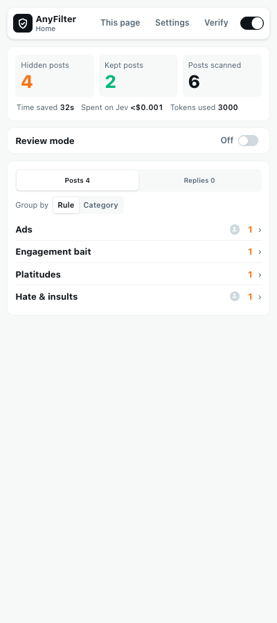
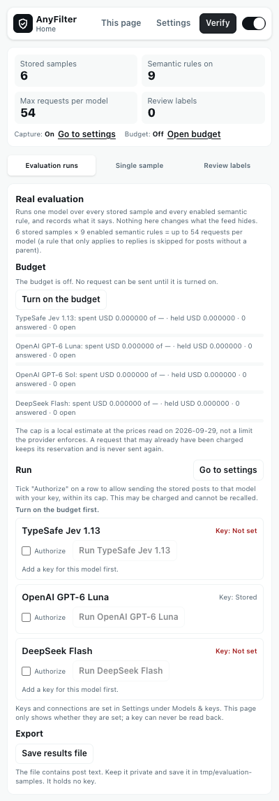
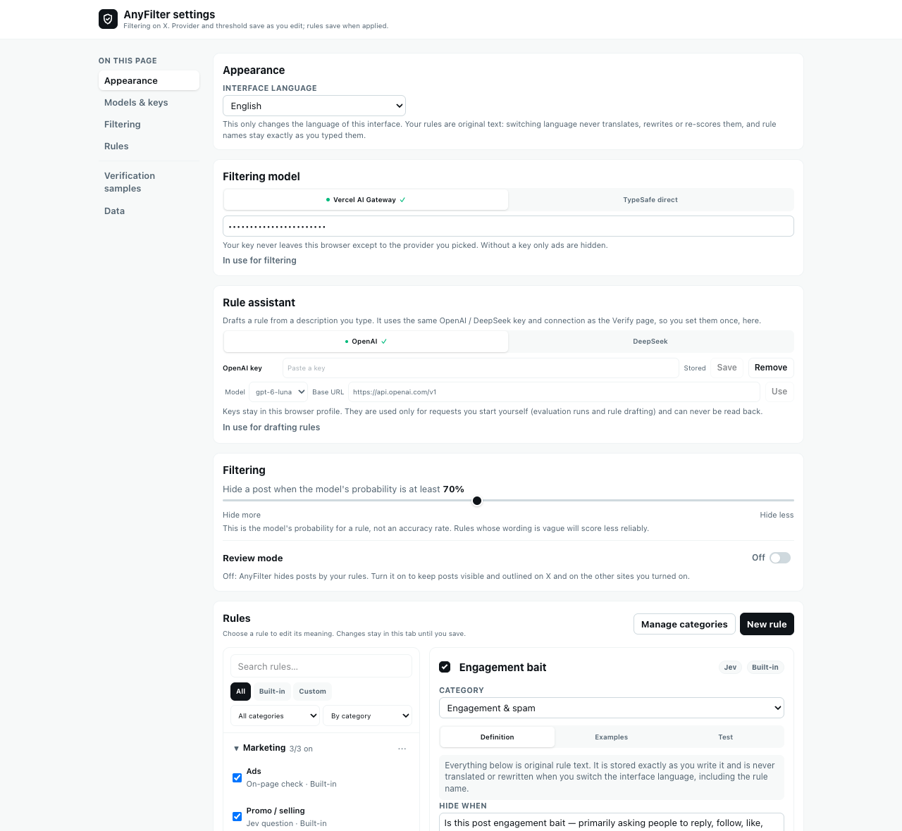
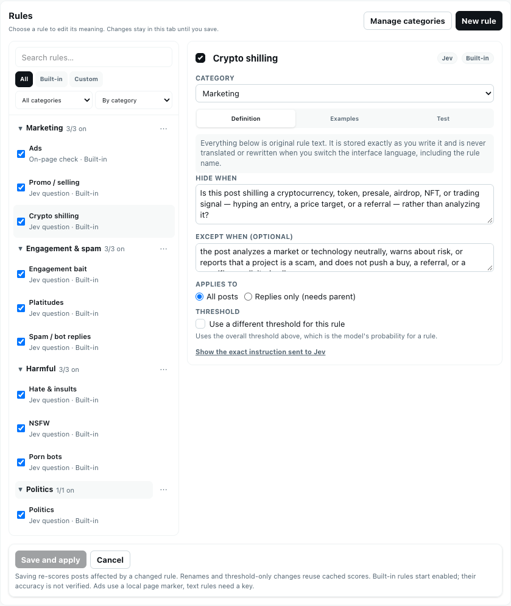
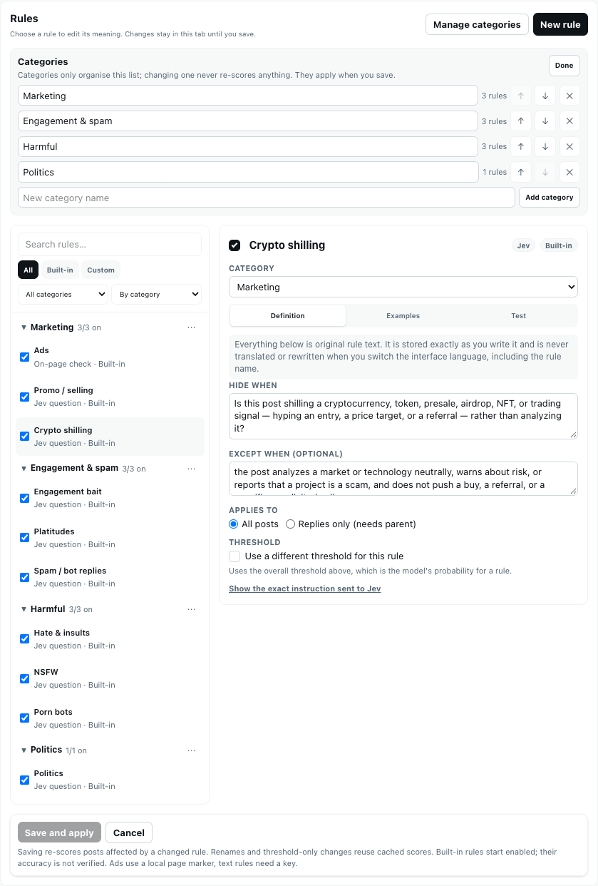
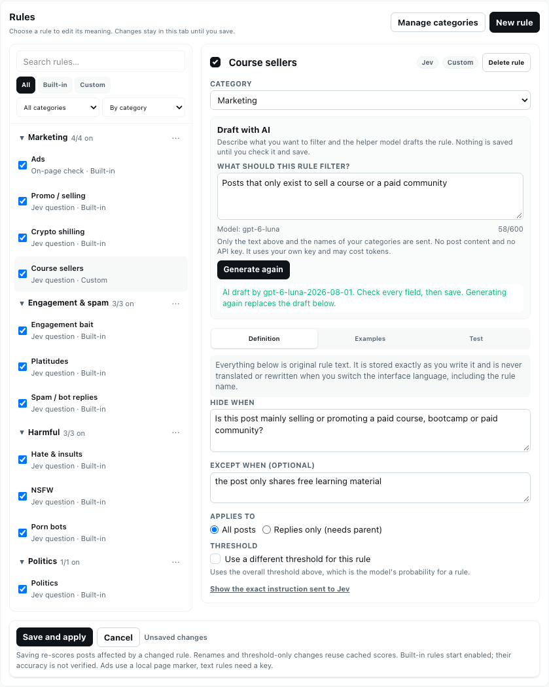

# AnyFilter

**English** | [简体中文](README.zh-CN.md)

Chrome extension that uses [Jev](https://typesafe.ai) to hide anything you don't want to see on any site, from ads and spam to whatever you describe in a sentence. X first, Hacker News and any web page too.

https://github.com/user-attachments/assets/2e81b289-9783-4fb4-8f07-9f8c307b0fba

<p>
  
  
</p>

## Highlights

- **Ten built-in rules**, ads, engagement bait, promo, platitudes, hate and insults, politics, NSFW, porn bots, spam replies and crypto shilling, sorted into four categories (Marketing, Engagement & spam, Harmful, Politics) that you can rename and extend.
- **Your own rules.** Write a condition, an exception and examples, choose how it applies (all posts or replies only) and give it its own threshold.
- **Describe it, get a rule.** Describe what you want filtered and the rule assistant (OpenAI or DeepSeek, your key) drafts the name, category, condition, exception and examples for you to check and save.
- **Test before you trust.** Paste a post into a rule's *Test* tab to see each rule's probability against its threshold, without saving anything or touching the page.
- **Review mode.** Posts stay visible with an outline that shows what AnyFilter would do, so you can tune rules before anything disappears.
- **Several surfaces.** The X home timeline, search, conversations, profiles and lists; Hacker News (opt-in); and a one-click judgement of any web page.
- **English and 简体中文** interface, switchable at any time.
- **Local first.** No server, no telemetry. Keys and rules stay in your browser; see [PRIVACY.md](PRIVACY.md).

## Install

1. Download `anyfilter-<version>-chrome.zip` from [Releases](../../releases) and unzip it.
2. Open `chrome://extensions`, turn on Developer mode, click "Load unpacked" and pick the unzipped folder.
3. Go to x.com and click the toolbar icon. The panel docks on the right.

To build it yourself: `pnpm install && pnpm build`, then load `.output/chrome-mv3`.

## Getting started

1. Open **Settings** in the panel (or **Open full page** for the wide layout) and go to *Models & keys*. Under *Filtering model*, pick a provider tab, paste a Jev key from [Vercel AI Gateway](https://vercel.com/ai-gateway/models/jev) or [TypeSafe](https://console.typesafe.ai) and press **Use this provider**. The key is stored locally and sent only to that provider as an authorization header.
2. A fresh install starts in **review mode**: nothing is hidden, and posts carry an outline showing the verdict. Turn review mode off (Home, or *Filtering* in Settings) when you want posts to actually disappear.
3. Scroll. Hidden posts appear on Home, grouped by rule or by category; click **Put back in feed** if Jev got one wrong.
4. If the home view shows a banner about a missing key or a failing provider, its button jumps straight to *Models & keys*. The banner is shown on every view except Settings.

## The settings page

The full page has a table of contents on the left that follows the section you are reading. Sections run from everyday to rare: Appearance, Models & keys, Filtering, Rules, then Verification samples and Data at the bottom.



- **Models & keys.** *Filtering model* has one tab per provider (Vercel AI Gateway, TypeSafe direct): a dot marks the one in use and a tick marks a stored key. Looking at a tab does not switch providers; **Use this provider** does. *Rule assistant* works the same way for OpenAI and DeepSeek, with the model and the base URL beside the key.
- **Filtering.** The probability threshold (default 70%) and the review-mode switch, side by side. The percentage is a model probability compared with your threshold, not an accuracy rate.
- **Data.** Clear hidden posts, hidden replies, or everything. Clearing everything asks for confirmation.

### Rules and categories



The list on the left groups rules under categories with an *on / total* count. Filter by *All / Built-in / Custom* or by category, and sort by category, name or enabled first. Each rule opens on the right with three tabs: *Definition* (condition, exception, scope, own threshold), *Examples* (what should and should not be hidden) and *Test*. **Save and apply** is pinned at the bottom and tells you when there are unsaved changes. In a narrow side panel the list and the rule take turns.



**Manage categories** adds, renames and deletes categories. Rules without a category sit under *Uncategorised*. A category only organises the list: it never changes a question sent to the model, so moving a rule never re-scores anything.

### Draft a rule with AI



1. Set an OpenAI or DeepSeek key under *Models & keys → Rule assistant*.
2. Press **New rule**, describe what you want filtered in your own words and press **Generate draft**.
3. The name, category, condition (written as an English yes/no question, like the built-in rules), exception and examples are filled in as an unsaved draft. Read them, change what you like, and press **Save and apply**.

Only your description and the names of your categories are sent, in one request that is never retried and is capped in length. No post is sent, and nothing is saved until you save. See [PRIVACY.md](PRIVACY.md).

## Where it works

- **X:** the home timeline, search results, a post's conversation, a user's profile (the Posts tab, `x.com/<handle>`) and a list (`x.com/i/lists/<id>`). Replies, Media and Likes tabs are left alone.
- **Hacker News** (optional, off until you turn it on in the panel's *Other sites* card): on list pages such as the front page and newest, hides titles that match your politics, crypto, NSFW and platitude rules and your own rules. Only the title, the host it links to and the submitter's name are sent; comments are not read. First version, checked on a few hundred titles by eye, not against human labels ([docs/hacker-news.md](docs/hacker-news.md)).
- **Any other web page:** click the toolbar icon on the page, then press **Judge this page** in the panel. It reads that one page once, on demand, and shows whether it reads like pure marketing or clickbait, with the probability and the threshold each rule uses. The page text is not stored. Optionally turn on **Auto judging** and allow sites one by one: pages on allowed sites are then judged when they finish loading in the front tab, and a match shows MKT or BAIT on the toolbar icon. It is off by default, has a USD 10 spending cap and a daily limit, and sends the same text as the button ([docs/auto-mode.md](docs/auto-mode.md)). The two rules are new and their thresholds (marketing 40%, clickbait 50%) were fitted on a small set of pages labelled by us; treat a result as a hint. What is sent is listed in [PRIVACY.md](PRIVACY.md); the rules and the evidence behind them are in [docs/article-rules.md](docs/article-rules.md).

Text only: rules read the post text, the author's name and handle, and quoted or parent text. Images and video are not analyzed. The full per-rule specification, including what each rule must not match and where it stops, is in [docs/filter-rules.md](docs/filter-rules.md).

## Verify

The **Verify** view checks the filter against real posts. A status strip keeps the numbers in view (stored samples, semantic rules on, the largest number of requests a run could make, review labels, capture state and budget state) with links to fix each. It has three tabs:

- **Evaluation runs:** the budget for each model, and one row per model (Jev, OpenAI, DeepSeek) with its key state, an authorization tick and a run button. Whatever blocks every row, such as a budget that is off or no samples, is stated once above the rows.
- **Single sample:** send one saved sample to one rule after you have read the exact text that will be sent.
- **Review labels:** count, export and delete the labels you made in review mode.

Collecting samples is switched on under *Verification samples* at the bottom of Settings. It is off by default, capped at 300 samples, copies already-loaded X post text to local storage only, makes no model call and cannot measure accuracy. Keys and connections for OpenAI and DeepSeek are set once, under *Models & keys*, and shared by the rule assistant and the evaluation. See [PRIVACY.md](PRIVACY.md) before enabling capture.

## Development

```bash
pnpm dev               # dev server with the extension loaded
pnpm typecheck
pnpm test:unit         # offline unit tests
pnpm eval:rules        # offline rule-evaluation report
pnpm e2e               # offline end-to-end run against static fixtures
pnpm e2e:page          # real headed Chrome: toolbar click, side panel, "Judge this page"
pnpm docs:screenshots  # retake the README screenshots (run pnpm build first)
```

`pnpm test:unit` runs `scripts/test/*.test.mjs` with Node's built-in test runner and no extra dependencies. It imports the extension's TypeScript sources directly through Node's type stripping, which `scripts/ts-loader.mjs` extends to cover the project's extensionless relative imports. Node 22.6 or newer is required; on an older Node the runner prints a skip notice instead of failing.

`pnpm eval:rules` prints per-rule precision, recall, false-hide, missed-hide and undecided rates with 95% confidence intervals. It is **fully offline** and uses a small hand-labelled fixture set with a deliberately toy keyword scorer. Its numbers say nothing about Jev's quality and are not a promise of accuracy. A real evaluation is only ever run by hand with explicit authorization and a budget — `pnpm eval:rules --remote` refuses to run automatically and prints the manual procedure. Continuous integration never makes a billable call.

`pnpm docs:screenshots` loads the built extension against the same fake X page and mocked providers as the e2e run, in English and 简体中文, and writes `screenshots/<locale>/*.png`. Nothing is sent anywhere, and the hidden-post lists stay collapsed so no post text appears.

### Real quality evaluation (by hand, opt-in)

The Verify view's **Evaluation runs** tab runs Jev, OpenAI `gpt-6-luna` and DeepSeek `deepseek-flash` over your saved verification samples. Each provider has its own USD 1 local cap, checked before every request; keys are typed into Settings and never shown or exported. Nothing runs on a schedule, and CI never makes a billable call.

1. Turn the budget on, add keys, authorize a run per labeller, then **Export results** (the file contains post text: keep it private).
2. `pnpm eval:import <export.json>` writes the blind-review inputs under `tmp/`: a random holdout batch first, then the disputed batch (samples the labellers disagree on). No machine answer reaches the review page.
3. `pnpm review:blind prepare`, label in the browser, then `pnpm review:blind apply <submission.json>`. Labels made in the on-page review mode are only hints.
4. `pnpm eval:report <export.json>` scores each labeller against the human labels only, per rule, source and split, and lists rule-change suggestions from the dev split. Suggestions are never applied automatically.
5. Labels made in the timeline (review mode) can be saved from the Verify view with "Export review labels". `pnpm review:report <file.json>` compares them with what the live filter decided, per post and per rule. They were made with the model's verdict on screen, so they point at posts worth a second look; they are not an answer key.
6. `pnpm rule:replay --labels <file.json> --pack <rule-pack.json>` replays a candidate rule pack against those labels and reports pass, fail or not enough data; `pnpm rule:apply --pack <rule-pack.json> --yes` puts it into the running extension (and `--rollback` puts the old rules back). See `docs/improvement-loop.md`.

`pnpm e2e` loads the built extension into Chromium, serves fake X pages from `scripts/fixtures/` and mocks Jev, OpenAI and DeepSeek. It intercepts every request, so it too never contacts a provider or spends tokens. It needs a Chromium build that can load an unpacked MV3 extension with its service worker; where that is unavailable it prints an explicit `SKIP` and exits 0 rather than hanging. If playwright-core can't find a browser, point it at one with `ANYFILTER_CHROMIUM=/path/to/chrome`.

Layout:

```
src/domain/          types, categories, rules and rule categories, compiler, verdicts, settings, ports
src/features/        feed-filter: scan, classify, hide
src/infrastructure/  Chrome storage, Jev adapters, rule drafting, X DOM reading and hiding
src/ui/sidepanel/    React side panel and settings page: rule list, rule detail, category manager, verify view
src/entrypoints/     content, background, sidepanel, options
scripts/             offline tests, evaluation report, e2e harness, README screenshots
```

To support another site, implement `domain/timeline-view.ts` for it and add its URL to the content script. Manual "Judge this page" on general web pages is implemented (stage 2, v1), and so are auto judging and Hacker News; more sites are still plans, in [docs/multi-site-design.md](docs/multi-site-design.md).

## License

MIT
