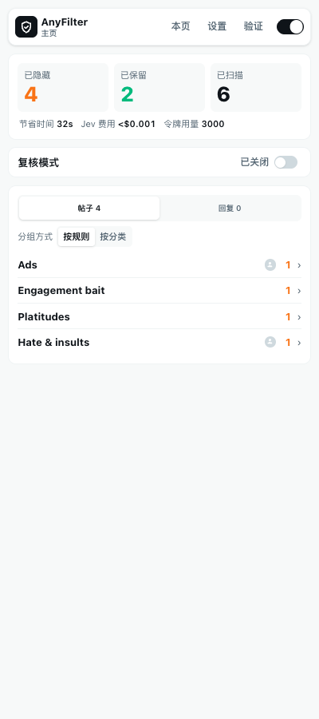
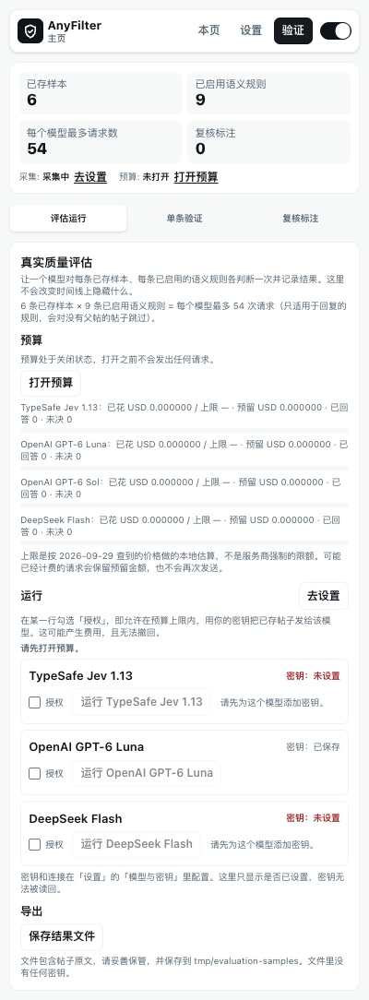
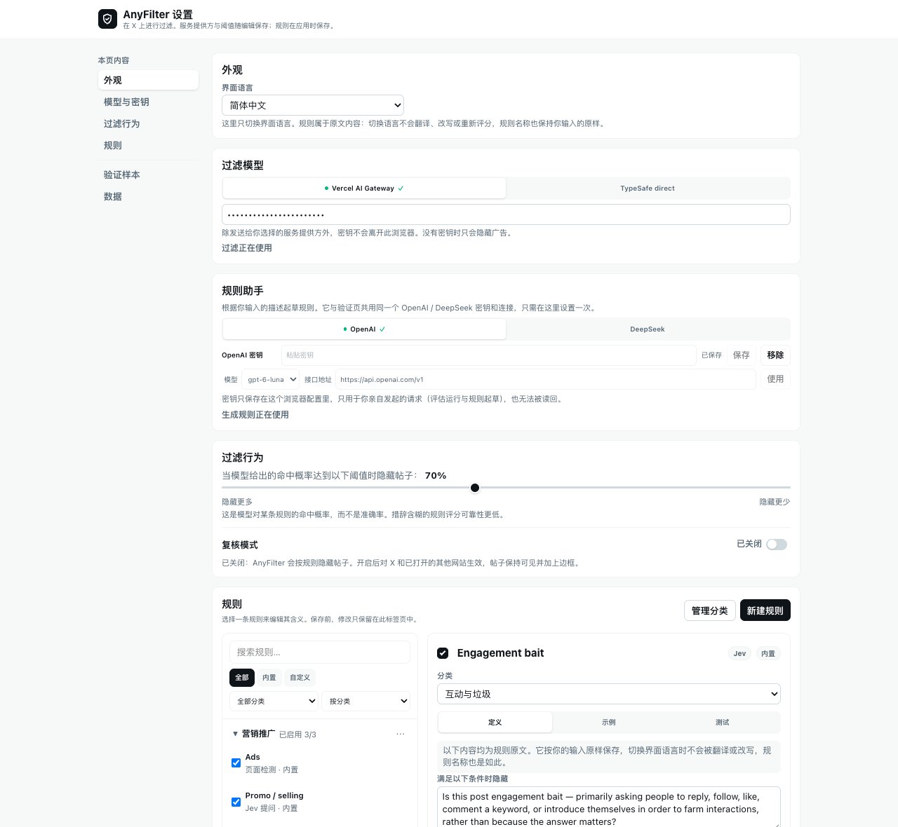
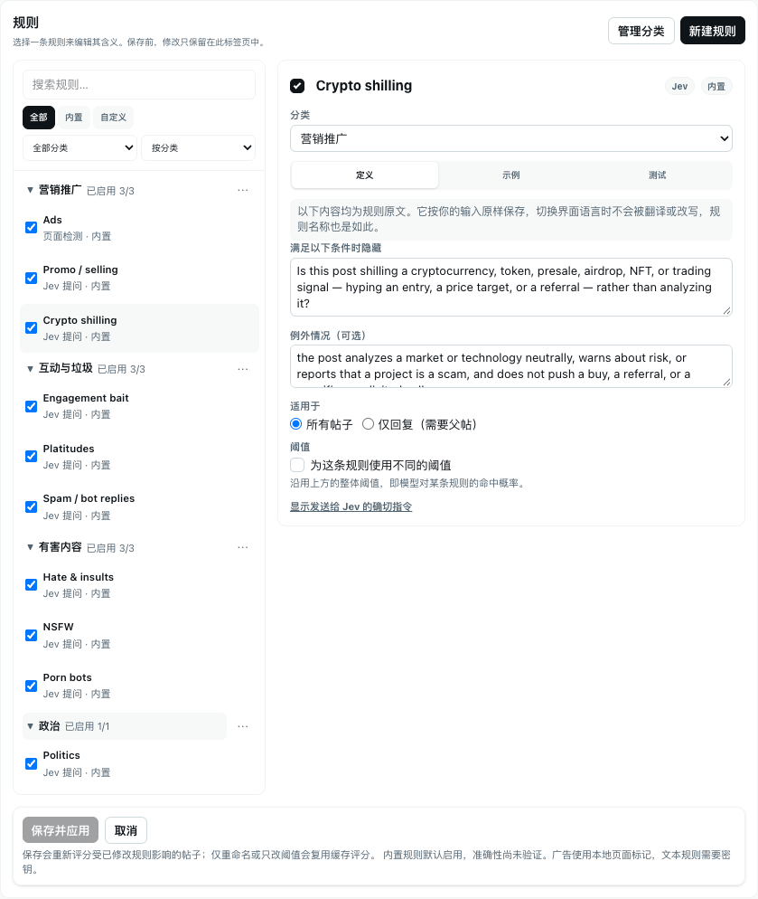
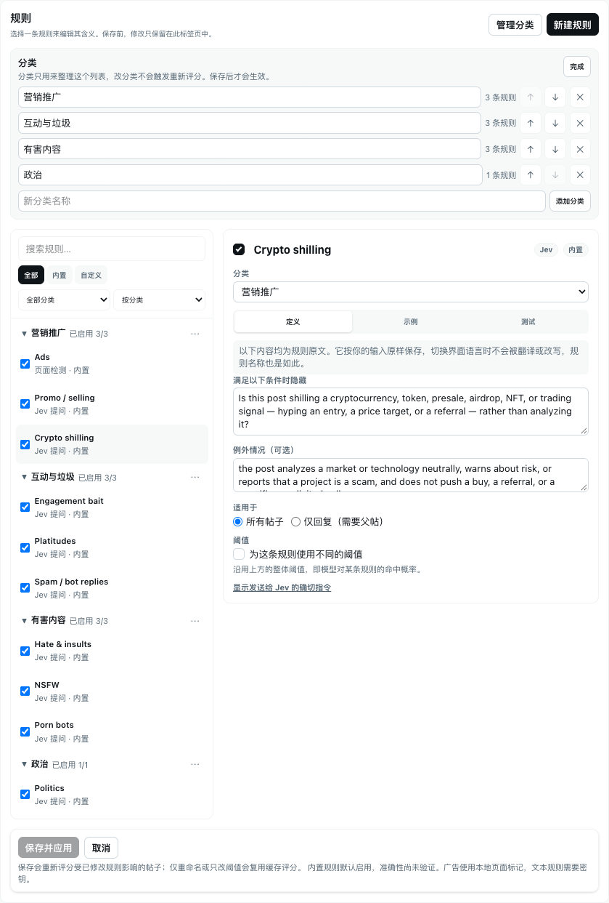
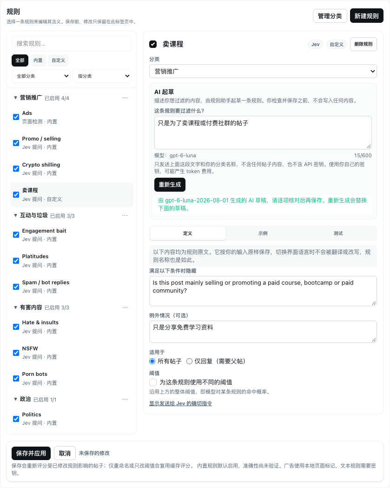

# AnyFilter

[English](README.md) | **简体中文**

基于 [Jev](https://typesafe.ai) 的 Chrome 扩展：在任意网站上隐藏你不想看的内容，从广告、垃圾信息到你用一句话描述的任何内容。首先支持 X，也支持 Hacker News 和任意网页。

https://github.com/user-attachments/assets/2e81b289-9783-4fb4-8f07-9f8c307b0fba

<p>
  
  
</p>

## 功能亮点

- **10 条内置规则**：广告、互动诱导、推广、空话套话、仇恨与辱骂、政治、NSFW、色情引流号、垃圾回复、加密货币吹捧。它们归入四个分类（营销推广、互动与垃圾、有害内容、政治），分类可以重命名和新增。
- **自定义规则**：写下判定条件、例外和示例，选择作用范围（全部帖子或仅回复），并可为每条规则单独设置阈值。
- **说出需求，生成规则**：描述你想过滤什么，规则助手（OpenAI 或 DeepSeek，使用你自己的密钥）会起草名称、分类、条件、例外和示例，由你检查后再保存。
- **先测试再信任**：把一条帖子粘贴到规则的「测试」页，查看每条规则的概率与阈值对比，不保存任何内容，也不会改动页面。
- **复核模式**：帖子保持可见，仅用轮廓标出 AnyFilter 会怎么处理，方便你在真正隐藏之前调好规则。
- **多种场景**：X 主页、搜索、会话、个人主页、列表；Hacker News（需手动开启）；以及一键判断任意网页。
- **中英文界面**，可随时切换。
- **本地优先**：没有服务器，没有遥测；密钥和规则只保存在你的浏览器里，详见 [PRIVACY.md](PRIVACY.md)（英文）。

## 安装

1. 从 [Releases](../../releases) 下载 `anyfilter-<version>-chrome.zip` 并解压。
2. 打开 `chrome://extensions`，开启「开发者模式」，点击「加载已解压的扩展程序」，选择解压后的文件夹。
3. 打开 x.com，点击工具栏图标，侧边栏会停靠在右侧。

自行构建：`pnpm install && pnpm build`，然后加载 `.output/chrome-mv3`。

## 快速开始

1. 在侧边栏打开**设置**（或点「在新标签页打开」使用宽屏布局），进入「模型与密钥」。在「过滤模型」下选择一个服务商标签，粘贴来自 [Vercel AI Gateway](https://vercel.com/ai-gateway/models/jev) 或 [TypeSafe](https://console.typesafe.ai) 的 Jev 密钥，然后点击「设为使用」。密钥只保存在本地，且仅作为授权头发送给该服务商。
2. 全新安装默认处于**复核模式**：不会隐藏任何内容，帖子上会有轮廓标出判定结果。想让帖子真正消失时，在主页或设置的「过滤行为」中关闭复核模式。
3. 正常浏览。被隐藏的帖子会显示在主页，并按规则或分类分组；如果 Jev 判断有误，点击「恢复到信息流」。
4. 如果主页出现缺少密钥或服务商故障的横幅，其按钮会直接跳转到「模型与密钥」。除设置页外，每个视图都会显示该横幅。

## 设置页

完整页面左侧是目录，会随你阅读的位置高亮。各部分由常用到少用：外观、模型与密钥、过滤行为、规则，最底部是验证样本和数据。



- **模型与密钥**：「过滤模型」每个服务商一个标签（Vercel AI Gateway、TypeSafe 直连），圆点表示正在使用，对勾表示已保存密钥。仅查看某个标签不会切换服务商，点击「设为使用」才会。「规则助手」的用法相同，面向 OpenAI 和 DeepSeek，模型和 Base URL 位于密钥旁边。
- **过滤行为**：概率阈值（默认 70%）与复核模式开关并排显示。百分比是模型给出的概率与你的阈值比较，并非准确率。
- **数据**：清除已隐藏的帖子、已隐藏的回复，或清除全部。清除全部需要确认。

### 规则与分类



左侧列表把规则按分类分组，并显示「已启用 / 总数」。可按「全部 / 内置 / 自定义」或按分类过滤，并按分类、名称或「已启用优先」排序。点击一条规则，右侧会打开三个标签：「定义」（条件、例外、作用范围、独立阈值）、「示例」（应该隐藏与不应隐藏的内容）和「测试」。「保存并应用」固定在底部，有未保存的更改时会提示。在较窄的侧边栏中，列表与规则详情轮流显示。



「管理分类」可以新增、重命名和删除分类。没有分类的规则归入「未分类」。分类只用于整理列表，不会改变发给模型的问题，因此移动规则不会导致重新打分。

### 用 AI 起草规则



1. 在「模型与密钥 → 规则助手」中设置 OpenAI 或 DeepSeek 密钥。
2. 点击「新建规则」，用自己的话描述想过滤的内容，点击「生成草稿」。
3. 名称、分类、条件（与内置规则一样，写成英文的是非问句）、例外和示例会作为未保存的草稿填好。检查并按需修改，再点击「保存并应用」。

只会发送你的描述和分类名称，仅一次请求，不会重试，输出长度有上限。不会发送任何帖子，保存之前也不会写入任何内容。详见 [PRIVACY.md](PRIVACY.md)。

## 适用范围

- **X：** 主页时间线、搜索结果、帖子会话页、用户个人主页（「帖子」标签，`x.com/<handle>`）和列表（`x.com/i/lists/<id>`）。回复、媒体、喜欢标签不处理。
- **Hacker News**（可选，需在侧边栏「其他网站」卡片中手动开启）：在首页、最新等列表页，隐藏符合你的政治、加密货币、NSFW、空话规则及自定义规则的标题。只发送标题、链接指向的域名和提交者用户名，不读取评论。这是第一个版本，仅对几百条标题做过人工目测，没有人工标注对照（[docs/hacker-news.md](docs/hacker-news.md)）。
- **其他网页：** 在页面上点击工具栏图标，再点击侧边栏的「判断本页」。它只在你操作时读取该页一次，显示这篇文章读起来是否像纯营销或标题党，以及各规则的概率与阈值。页面文本不会被保存。你也可以开启**自动判断**并逐个允许网站：允许的网站上的页面在前台标签加载完成后会自动判断，命中时工具栏图标显示 MKT 或 BAIT。它默认关闭，有 10 美元的花费上限和每日次数限制，发送的内容与手动按钮相同（[docs/auto-mode.md](docs/auto-mode.md)）。这两条规则是新的，阈值（营销 40%、标题党 50%）来自我们自己标注的一小批页面，结果仅作提示。发送的内容清单见 [PRIVACY.md](PRIVACY.md)，规则及依据见 [docs/article-rules.md](docs/article-rules.md)。

仅处理文本：规则读取帖子文本、作者名称和账号，以及引用或被回复的文本；不分析图片和视频。每条规则的完整说明（包括它不该匹配什么、边界在哪里）见 [docs/filter-rules.md](docs/filter-rules.md)。

## 验证页

**验证**页用真实帖子检验过滤效果。顶部状态条始终显示关键数字（已存样本、启用的语义规则、一次运行最多的请求数、复核标注、采集状态与预算状态），并附有修复入口。它有三个标签：

- **评估运行：** 每个模型的预算，以及每个模型（Jev、OpenAI、DeepSeek）一行：密钥状态、授权勾选和运行按钮。所有行共同的阻塞原因（例如预算未开启或没有样本）只会在行的上方说明一次。
- **单条验证：** 在你读过将要发送的确切文本后，把一条已保存的样本发送给一条规则。
- **复核标注：** 统计、导出和删除你在复核模式下做的标注。

样本采集在设置页底部的「验证样本」中开启。它默认关闭，最多保存 300 条，只把已加载的 X 帖子文本复制到本地存储，不调用模型，也无法衡量准确率。OpenAI 和 DeepSeek 的密钥与连接只需在「模型与密钥」里设置一次，由规则助手和评估共用。开启采集前请先阅读 [PRIVACY.md](PRIVACY.md)。

## 开发

```bash
pnpm dev               # 开发服务器（自动加载扩展）
pnpm typecheck
pnpm test:unit         # 离线单元测试
pnpm eval:rules        # 离线规则评估报告
pnpm e2e               # 基于静态页面的离线端到端测试
pnpm e2e:page          # 真实有界面 Chrome：工具栏点击、侧边栏、「判断本页」
pnpm docs:screenshots  # 重新生成 README 截图（先运行 pnpm build）
```

`pnpm test:unit` 使用 Node 内置测试运行器运行 `scripts/test/*.test.mjs`，无需额外依赖。它通过 Node 的类型剥离直接导入扩展的 TypeScript 源码，`scripts/ts-loader.mjs` 对其做了扩展以支持项目里不带扩展名的相对导入。需要 Node 22.6 或更新版本；旧版本会打印跳过提示而不是失败。

`pnpm eval:rules` 输出每条规则的精确率、召回率、误隐藏率、漏隐藏率和未决率，并附 95% 置信区间。它**完全离线**，使用一小份人工标注的样例和刻意简化的关键词打分器，其数字不代表 Jev 的质量，也不是准确率承诺。真实评估只能在明确授权和预算下手动运行；`pnpm eval:rules --remote` 会拒绝自动运行并打印手动流程。持续集成从不发起计费调用。

`pnpm docs:screenshots` 会用与 e2e 相同的模拟 X 页面和模拟服务商加载构建好的扩展，分别以英文和简体中文生成 `screenshots/<locale>/*.png`。不会向任何地方发送请求，已隐藏帖子列表保持折叠，因此截图中不会出现帖子文本。

### 真实质量评估（手动、需主动开启）

验证页的**评估运行**标签会让 Jev、OpenAI `gpt-6-luna` 和 DeepSeek `deepseek-flash` 对你保存的验证样本各跑一遍。每个服务商各有 1 美元的本地上限，并在每次请求前检查；密钥在设置中输入，之后不会再显示也不会导出。不会有任何定时运行，CI 也从不发起计费调用。

1. 开启预算、添加密钥、为每个标注者授权一次运行，然后**导出结果**（文件包含帖子文本，请保密）。
2. `pnpm eval:import <export.json>` 在 `tmp/` 下写出盲评输入：先是随机留出批次，再是有争议批次（标注者意见不一致的样本）。任何机器答案都不会进入评审页面。
3. `pnpm review:blind prepare`，在浏览器中标注，然后 `pnpm review:blind apply <submission.json>`。页面内复核模式做的标注只是提示。
4. `pnpm eval:report <export.json>` 仅以人工标注为准，按规则、来源和数据划分给每个标注者打分，并根据开发集列出规则修改建议。建议不会被自动应用。
5. 在时间线（复核模式）里做的标注可以在验证页用「导出复核标注」保存。`pnpm review:report <file.json>` 会逐帖、逐规则将其与实时过滤的决定对比。这些标注是在看到模型判定的情况下做的，因此只能指出值得再看一眼的帖子，不是标准答案。
6. `pnpm rule:replay --labels <file.json> --pack <rule-pack.json>` 用这些标注回放候选规则包，报告通过、失败或数据不足；`pnpm rule:apply --pack <rule-pack.json> --yes` 把它写入运行中的扩展（`--rollback` 恢复旧规则）。详见 `docs/improvement-loop.md`。

`pnpm e2e` 把构建好的扩展加载进 Chromium，从 `scripts/fixtures/` 提供模拟的 X 页面，并模拟 Jev、OpenAI 和 DeepSeek。它拦截所有请求，因此同样不会联系服务商或消耗 token。它需要能加载带 service worker 的未打包 MV3 扩展的 Chromium；不可用时会明确打印 `SKIP` 并以 0 退出，而不是卡住。如果 playwright-core 找不到浏览器，用 `ANYFILTER_CHROMIUM=/path/to/chrome` 指定。

目录结构：

```
src/domain/          类型、分类、规则与规则分类、编译器、判定、设置、端口
src/features/        feed-filter：扫描、分类、隐藏
src/infrastructure/  Chrome 存储、Jev 适配器、规则起草、X DOM 读取与隐藏
src/ui/sidepanel/    React 侧边栏与设置页：规则列表、规则详情、分类管理、验证页
src/entrypoints/     content、background、sidepanel、options
scripts/             离线测试、评估报告、e2e 框架、README 截图
```

要支持另一个网站，为它实现 `domain/timeline-view.ts` 并把其 URL 加入 content script。通用网页的手动「判断本页」（第 2 阶段 v1）、自动判断和 Hacker News 已实现；更多网站仍在计划中，见 [docs/multi-site-design.md](docs/multi-site-design.md)。

## 许可证

MIT
